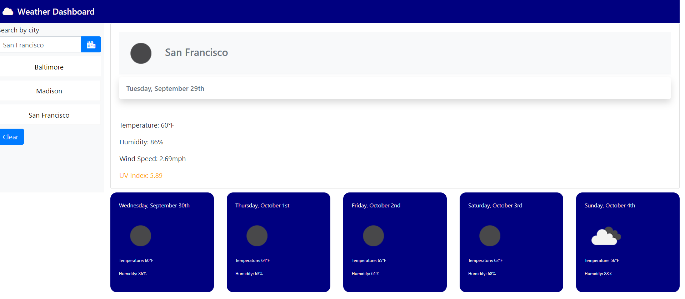

# Weather Dashboard
  
  ## Table of Contents
  * [Description](#Description)
  * [Deployment](#Deployment)
  * [Usage](#Usage)
  * [Technologies](#Technologies)
  * [Questions](#Questions)
  * [License](#License)
  ## Description
  The weather dashboard generates the daily and five day forecast for a user-entered city. The dashboard keeps a search history of the cities entered. Saved searches are    buttons that return the daily and five day forecast. The list can be cleared using the clear button. 
  ## [Deployment](https://jrtwheeler.github.io/Weather-Dashboard/)
  ## Usage
To return a five day forecast, enter a city in the search bar and then click the search button. The forecast includes temperature, humidity, wind speed, UV index, and a graphic for the weather. The app saves the cities entered in the search form.
 
  ## Technologies
* Javascript
* JQUERY
* CSS
* HTML
* Bootstrap
* Bulma
* API
* https://api.openweathermap.org/data/2.5/forecast
* https://openweathermap.org/img/wn/
* AJAX calls
  ## Questions
  If you have any further questions, please contact me at jwheele1@gmail.com.
  My GitHub profile is [Github Repo](https://github.com/jrtwheeler).
    ## License
  Copyright (c) Microsoft Corporation. All rights reserved.
  
  Licensed under the MIT license.
